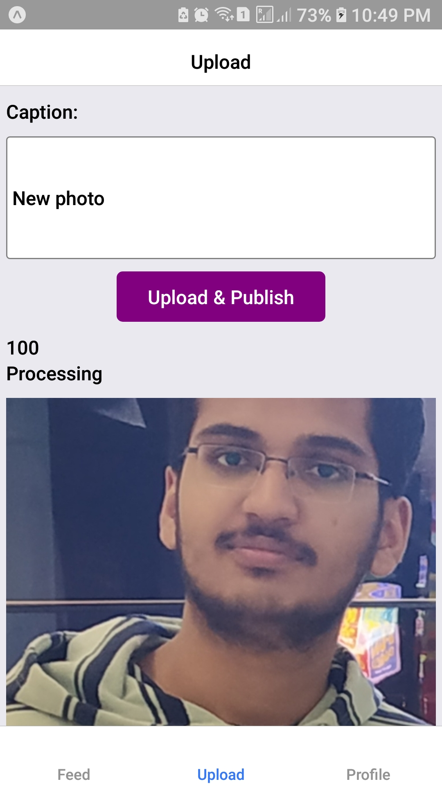
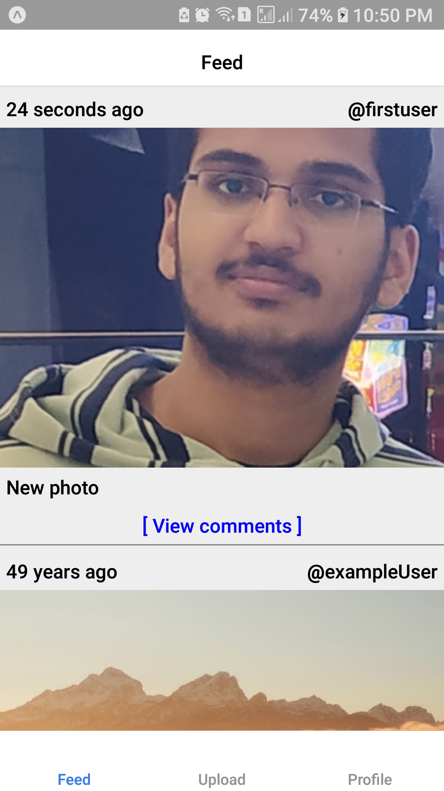
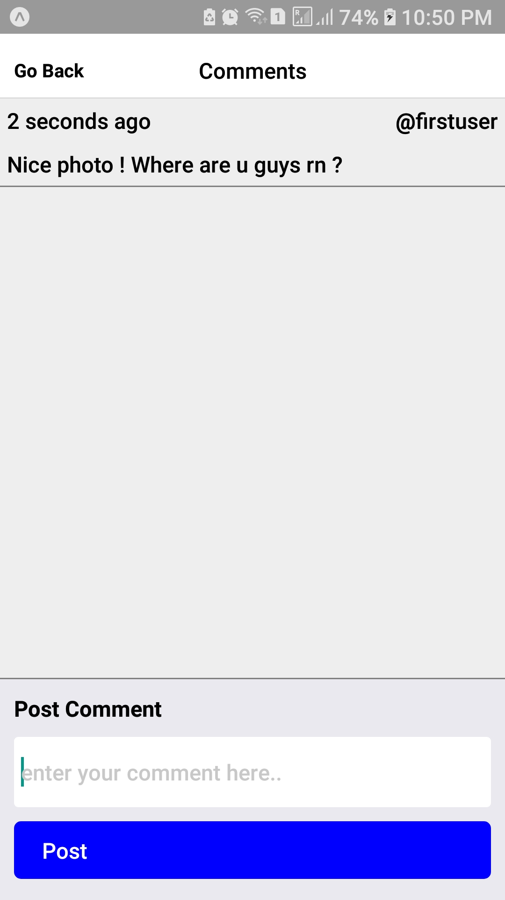
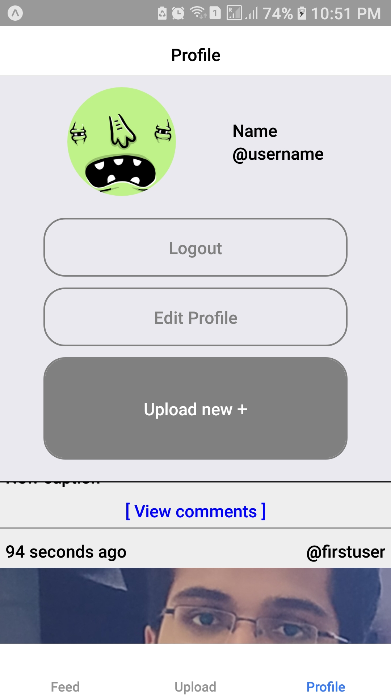

# instagram-clone
Photo sharing app like Instagram.

### Frameworks / Services Used:
- React Native + Expo Development Tools
- Firebase storage
- Firebase authentication
- Firebase database

### Screenshots from the app:

